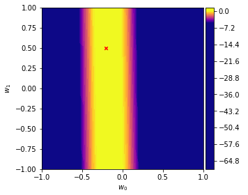
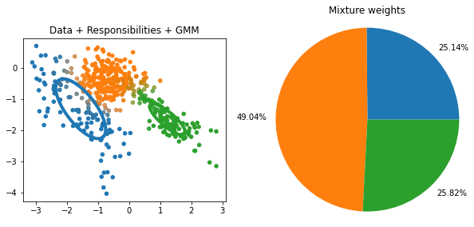
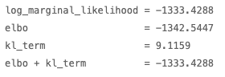

# Machine Learning Notebooks
These are some jupyter notebooks I created during my time as a TA to explain and visualize concepts from the Machine Learning 1 lecture at Karlsruhe Institue of Technology.

## Bayesian Linear Regression
Visualize Bayesian Linear Regression with the notebook ```./blr_recap/blr_recap.ipynb```.



## Expectation Maximization
Visualize Expectation Maximization with the notebook ```./em_recap/em_recap.ipynb```.

